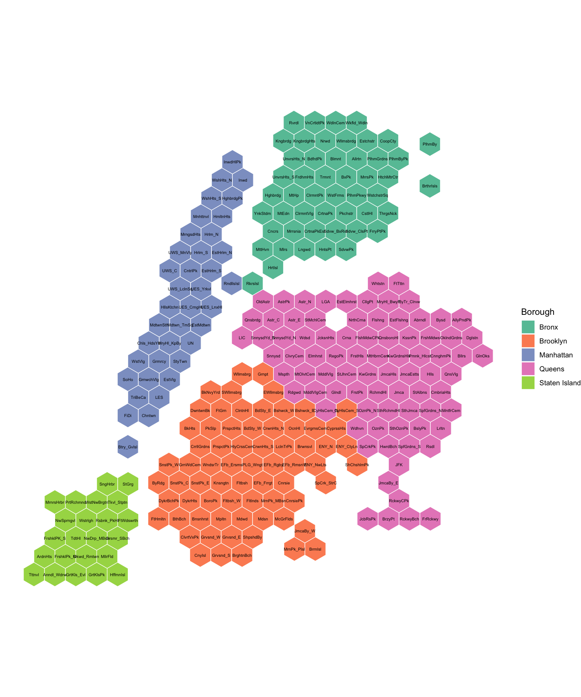
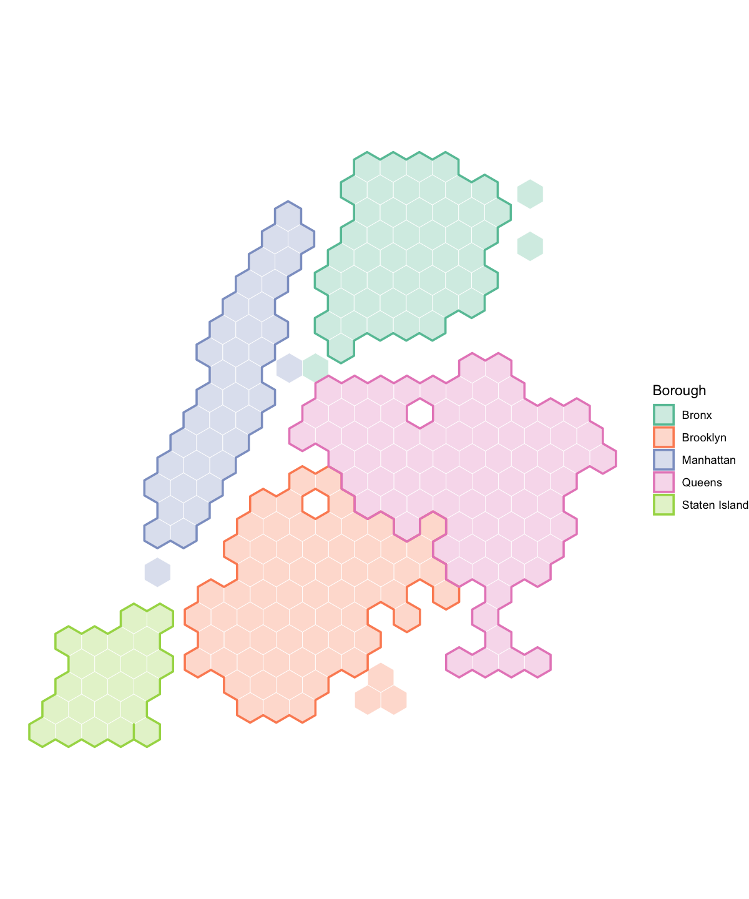
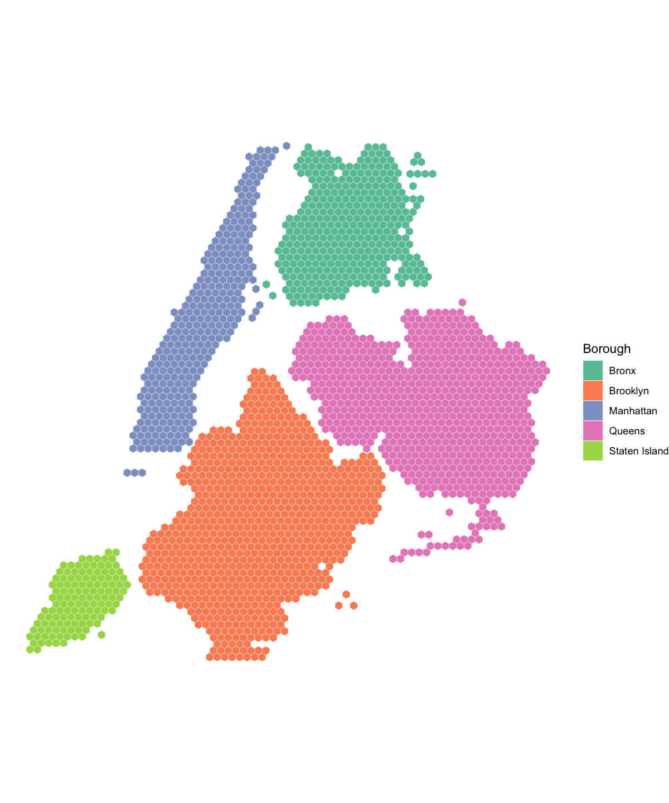
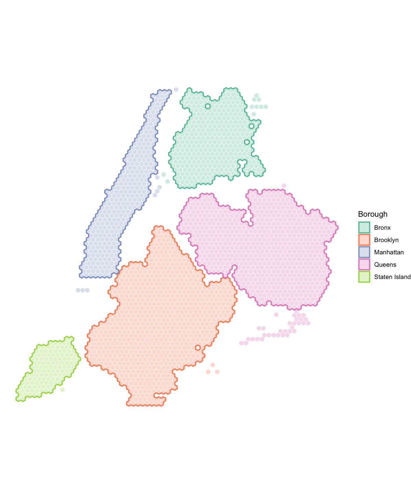
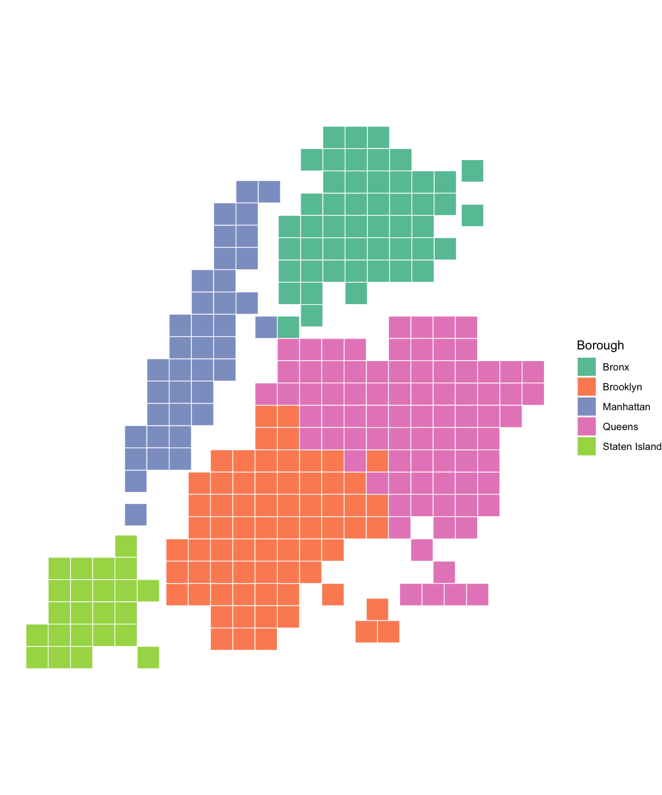
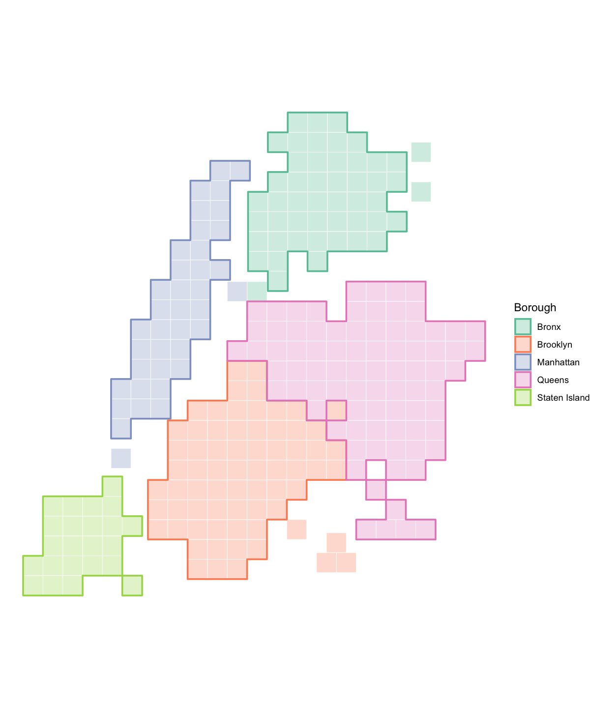
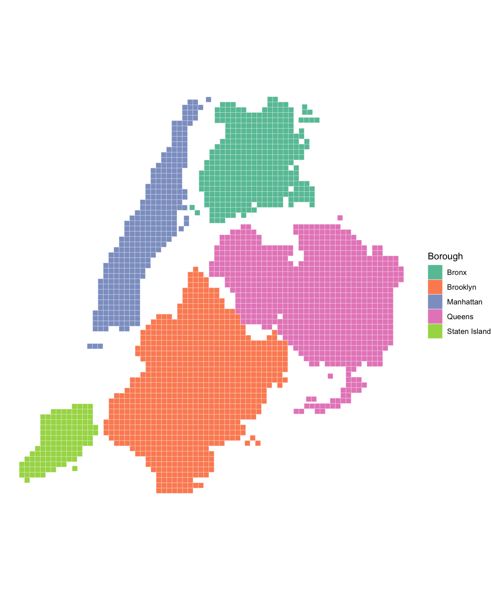
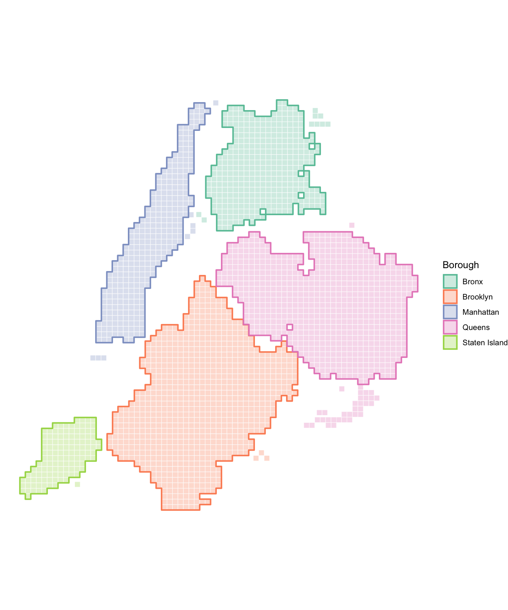

<!-- README.md is generated from README.Rmd. Please edit that file -->

# nychex 

<!-- badges: start -->

[](https://github.com/kjhealy/nychex/actions/workflows/R-CMD-check.yaml)
[](https://kjhealy.r-universe.dev/nychex)
<!-- badges: end -->

nychex provides tessellated hexagonal and and square tile maps for New
York City administrative geographies. Each polygon in the source
geography is represented by a single tile, arranged to approximate the
overall spatial layout of the city.

## Installation

You can install the development version of nychex from
[GitHub](https://github.com/kjhealy/nychex) with:

``` r
# install.packages("pak")
pak::pak("kjhealy/nychex")
```

Alternatively, install this package from my
[r-universe](https://kjhealy.r-universe.dev):

``` r
install.packages(
  "nychex",
  repos = c("https://kjhealy.r-universe.dev", "https://cloud.r-project.org")
)
```

Including `https://cloud.r-project.org` ensures dependencies on CRAN are
resolved automatically.

## NTA-level Hex Tiles and Outlines

``` r
library(ggplot2)
library(nychex)

ggplot(nyc_nta20_hex_sf) +
  geom_sf(aes(fill = boro_name), color = "white", linewidth = 0.3) +
  scale_fill_brewer(palette = "Set2") +
  labs(fill = "Borough") +
  theme_void()
```


``` r
ggplot(nyc_nta20_hex_sf) +
  geom_sf(aes(fill = boro_name), color = "white", linewidth = 0.3) +
  geom_sf_text(aes(label = nta_abbrev), size = 1.8) +
  scale_fill_brewer(palette = "Set2") +
  labs(fill = "Borough") +
  theme_void()
```



Borough outlines are also available via `nyc_nta_boros_hex_sf`, with
separate outlines for Brooklyn and Queens:

``` r
ggplot() +
  geom_sf(
    data = nyc_nta20_hex_sf,
    aes(fill = boro_name),
    color = "white",
    linewidth = 0.2,
    alpha = 0.3
  ) +
  geom_sf(
    data = nyc_nta_boros_hex_sf,
    aes(color = boro_name),
    fill = NA,
    linewidth = 0.8
  ) +
  scale_fill_brewer(palette = "Set2") +
  scale_color_brewer(palette = "Set2") +
  labs(fill = "Borough", color = "Borough") +
  theme_void()
```



## Tract-level Hex Tiles and Outlines

A census tract level hex map is also available via `nyc_ct20_hex_sf`
(2,325 tracts), with its own borough outlines in `nyc_ct_boros_hex_sf`:

``` r
ggplot(nyc_ct20_hex_sf) +
  geom_sf(aes(fill = boro_name), color = "white", linewidth = 0.1) +
  scale_fill_brewer(palette = "Set2") +
  labs(fill = "Borough") +
  theme_void()
```



``` r
ggplot() +
  geom_sf(
    data = nyc_ct20_hex_sf,
    aes(fill = boro_name),
    color = "white",
    linewidth = 0.2,
    alpha = 0.3
  ) +
  geom_sf(
    data = nyc_ct_boros_hex_sf,
    aes(color = boro_name),
    fill = NA,
    linewidth = 0.8
  ) +
  scale_fill_brewer(palette = "Set2") +
  scale_color_brewer(palette = "Set2") +
  labs(fill = "Borough", color = "Borough") +
  theme_void()
```



## NTA-level Square Tiles

A square tile variant is available via `nyc_nta20_sq_sf`:

``` r
ggplot(nyc_nta20_sq_sf) +
  geom_sf(aes(fill = boro_name), color = "white", linewidth = 0.3) +
  scale_fill_brewer(palette = "Set2") +
  labs(fill = "Borough") +
  theme_void()
```



Borough outlines for the square map are available via
`nyc_nta_boros_sq_sf`:

``` r
ggplot() +
  geom_sf(
    data = nyc_nta20_sq_sf,
    aes(fill = boro_name),
    color = "white",
    linewidth = 0.2,
    alpha = 0.3
  ) +
  geom_sf(
    data = nyc_nta_boros_sq_sf,
    aes(color = boro_name),
    fill = NA,
    linewidth = 0.8
  ) +
  scale_fill_brewer(palette = "Set2") +
  scale_color_brewer(palette = "Set2") +
  labs(fill = "Borough", color = "Borough") +
  theme_void()
```



## Tract-level Square Tiles

Census tract level square tile maps are available via `nyc_ct20_sq_sf`
(2,325 tracts), with borough outlines in `nyc_ct_boros_sq_sf`:

``` r
ggplot(nyc_ct20_sq_sf) +
  geom_sf(aes(fill = boro_name), color = "white", linewidth = 0.1) +
  scale_fill_brewer(palette = "Set2") +
  labs(fill = "Borough") +
  theme_void()
```



``` r
ggplot() +
  geom_sf(
    data = nyc_ct20_sq_sf,
    aes(fill = boro_name),
    color = "white",
    linewidth = 0.2,
    alpha = 0.3
  ) +
  geom_sf(
    data = nyc_ct_boros_sq_sf,
    aes(color = boro_name),
    fill = NA,
    linewidth = 0.8
  ) +
  scale_fill_brewer(palette = "Set2") +
  scale_color_brewer(palette = "Set2") +
  labs(fill = "Borough", color = "Borough") +
  theme_void()
```


